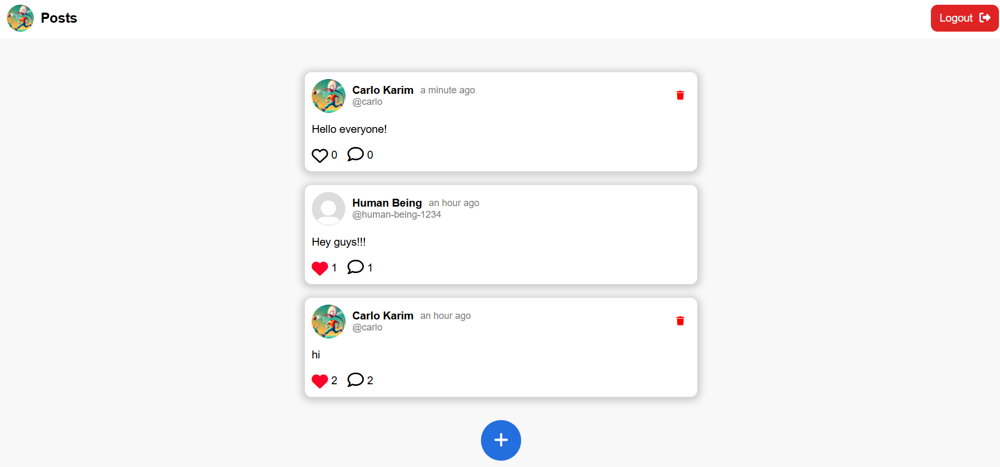
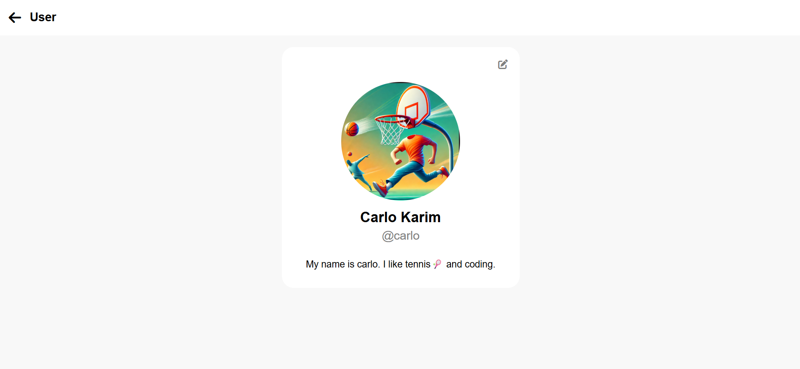

# 🧠 Mini Social Media

A lightweight, fully functional social media web app built with Django.

Users can sign up, post, like, comment, edit their profiles, and more. This project was built in just 2 days to demonstrate rapid development skills, full-stack understanding, and deployment readiness.

---

## 🚀 Live Demo

🌐 [carloo.pythonanywhere.com](http://carloo.pythonanywhere.com)

---

## 📸 Screenshots

<!-- Add your own screenshots below -->

---

## 🛠 Features

- 🔐 User Authentication (Signup, Login, Logout)
- 📝 Post creation & deletion
- 💬 Comments with add/delete
- ❤️ Like system (toggle-like)
- 🧑‍💻 Editable user profiles (with profile pictures)
- 👤 View other users' profiles
- 🗂️ Media upload handling
- 🌐 Fully deployed & live on PythonAnywhere

---

## 🧰 Tech Stack

- **Backend**: Django (Python)
- **Frontend**: HTML, CSS, JavaScript
- **Database**: SQLite (local), PythonAnywhere default (prod)
- **Version Control**: Git + GitHub
